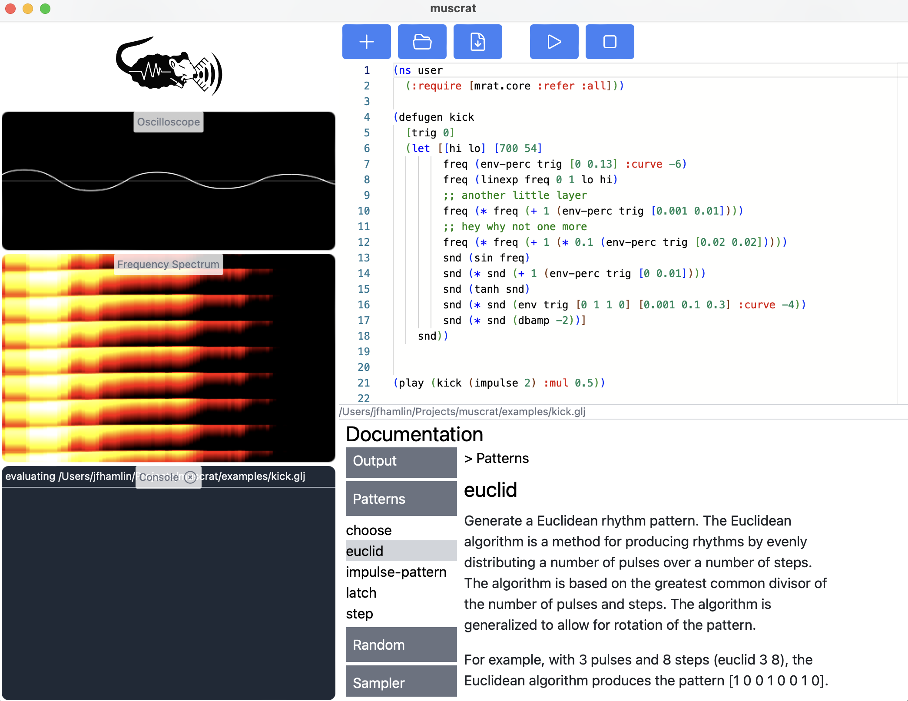

# muscrat

<p align="center">
  
</p>
<p align="center">
  
</p>

## Supported Platforms

muscrat runs only on MacOS. Other platforms may be supported in the
future. File an issue or open a pull request if you

## Installation

If you're running MacOS on arm64, download the latest release .pkg
installer from the [releases
page](https://github.com/jfhamlin/muscrat/releases).

Otherwise, clone the repository and run:
```shell
make
```

